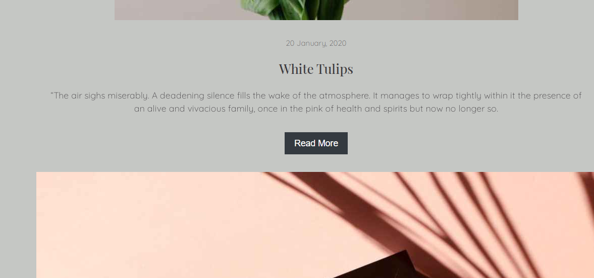

# $${\color{lightgreen}SL \space Journal}$$

#### Video Demo:  <https://youtu.be/0K-0Hm0yc64>
#### Website Link:  <https://sanskritilabroo.github.io/sljournal.github.io/>
## Description
A blogpage created using technological elements of HTML,CSS & JavaScript through which one can upload writeups on topics of interest. Also adaptable and responsive to different widths and lengths made for smooth working and flow on different devices whether phone, tablet or laptop. The video demonstrates the working of the website in live action, combining all the code with external assets such as photos accompanying the blogs that make it more interactive and appealing. The implementation is fairly simple, to keep the project scope in check.
- #### index.html:
contains code to form the main/opening homepage containing nav bar, a design image, an about+skills section, projects/blogs section and finally a subscribe button.
- #### blogs.html:
lists out all the blogs hosted on the website in detail to avail the articles as the homepage only provides a glimpse to the latest blogs that can be accessed by readers, there are also additional html pages - dedicated to each of the blogs.
- #### css:
simple and minimalistic blue/grey design with wide use of images as an overriding theme throughout the pages of my blog with google API used for fonts and Font Awesome used for icons such as the social media links in the footer and the dark/light mode switch.

  

| Homepage | About |
| :---: | :---: |
|   | |

| Blogs | Blogpage |
| :---: | :---: |
|   | |

- #### Possible improvements
1. Likes, Comments, Views/Statistics incorporated on posts
2. Contact Me Page/Forum Open To Discussion
3. Personal Projects/Skills Showcase

## About CS50
CS50 is a openware course from Havard University and taught by David J. Malan
Introduction to the intellectual enterprises of computer science and the art of programming. This course teaches students how to think algorithmically
and solve problems efficiently. Topics include abstraction, algorithms, data structures, encapsulation, resource management, security, and software engineering.
Languages include C, Python, and SQL plus students’ choice of: HTML, CSS, and JavaScript (for web development).
- Where do I get CS50 course?
https://cs50.harvard.edu/x/2020/
